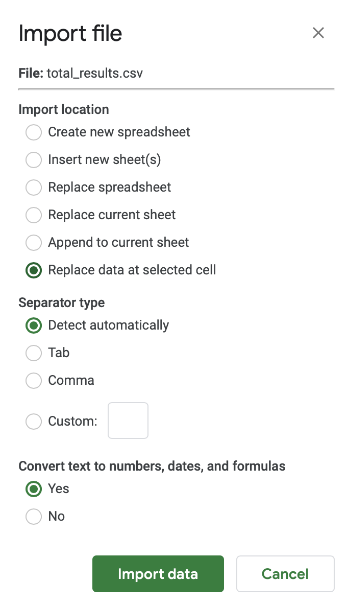

# Accompanying Questions

- What do you see when you run the program?
- Now that you have ran the program and seen it's basic output, what do you think is going on?
- Were the decisions rendered by the program correct or incorrect? How often were they correct? Why do you think so?
- How does your behavior influence the data of the program?
- Were there any trials that heavily skewed your overall results?
- How can you be profiled/tracked based on your online behavior?
  - How is entering random letters on a keyboard similar to surfing the web in the way that your information is tracked?
  - If you like everything you see on Instagram, without rhyme or reason, what are some possible implications?
  - If your data is used incorrectly, for say ad recommendations, what happen? What are the implications associated with making  incorrect biases?
  - Can you think of a way to reduce potential biases in the algorithms making inferences about users? Do you feel the government should make companies more liable for incorrectly using and tracking user data?
- While this assignment looks to use the idea of hand bias to portray larger biases in online algorithms, on say mobile phones is hand bias a real thing? Could this skew results? For instance, Instagrams polls always put the "Yes" option on the left side of the screen. Additionally, most phone users seem to put their commonly used apps on the side of the screen where their dominant hand lies.

## Other Information

How to import a `results.csv` file of a user's four trials saved from running the `qazplm.py` program:

